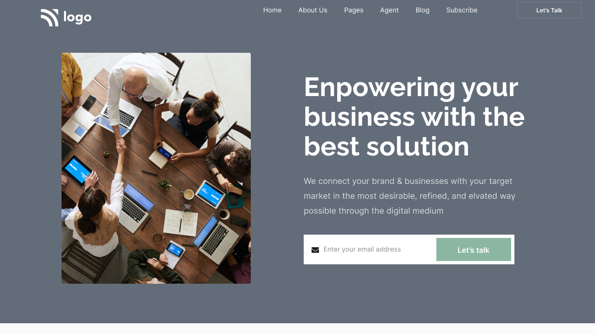
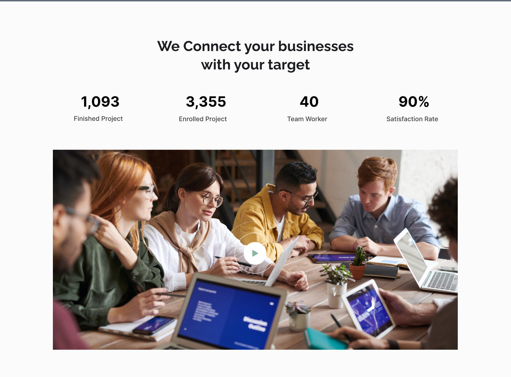
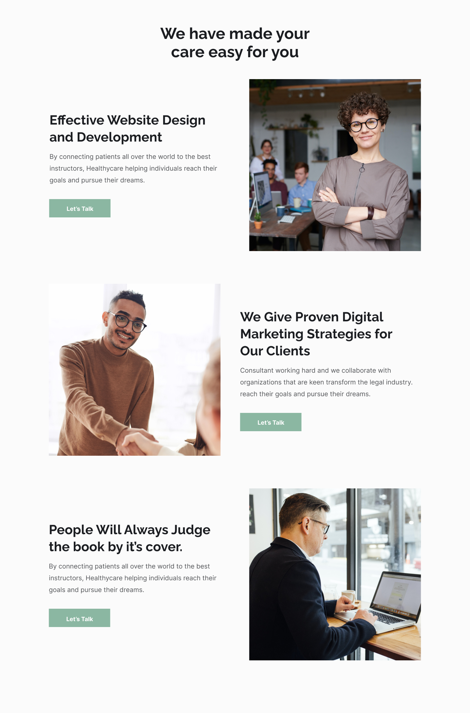
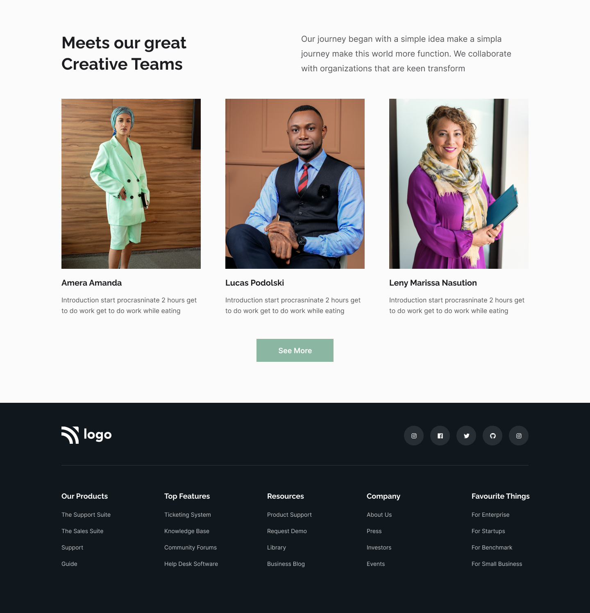

## Firstly, I'd like to thanks [Hitesh Sir](https://twitter.com/Hiteshdotcom) & the team of [iNeuron](https://ineuron.ai) for designing such a beautiful project which made me realise my potential.

## 🚀 About Me
>I'm a front-end developer...

# Hi, I'm shaQuib! 👋

## 🛠 Skills used in building this project
>HTML5 & CSS...

## Name of the Project

 > Business Landing Page
 
## Time taken to complete this project
> 9 hours

## `Learning curve`
***
 - How to arrange a navbar using just `Flexbox`
 - How to contain and make complex card deaign using pure CSS
 - How to put svg images in a card and add different sections to it by just using CSS
 - Learn the implementaion of `wrap` property of flexbox.

 - And most importantly the confidence to convert any wireframe into a brautiful web pages.

## `Final Interface`

*** 
- Below are the some screen shots how does this web app page looks like while running on the browser.

